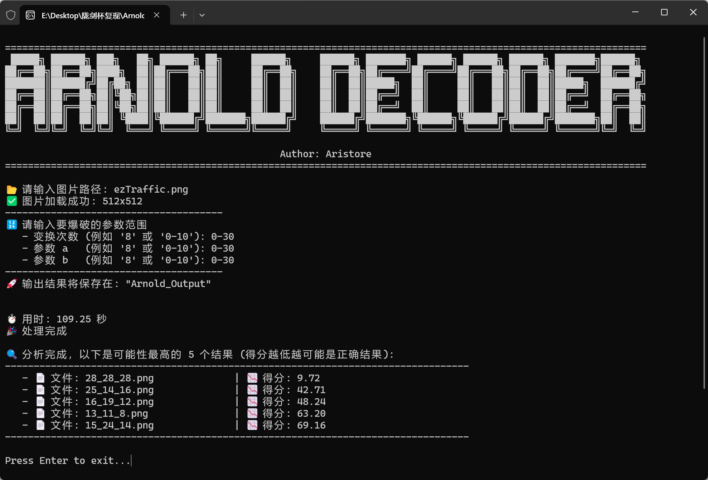

# Arnold Decoder

[](https://www.rust-lang.org/)

一个用于暴力破解**猫变换（Arnold's Cat Map）**加密图像的命令行工具。

当你拿到一张被阿诺德变换打乱的图片，但不知道加密时使用的**变换次数(t)**、**参数a**和**参数b**时，本工具可以帮助你快速找回原图。




## 简介

[猫变换（Arnold's Cat Map）](https://en.wikipedia.org/wiki/Arnold%27s_cat_map)是一种图像置乱技术，它通过特定的数学变换将图像的像素打乱，使其看起来毫无规律。解密需要知道三个关键参数：**变换次数(shuffle_times)**、**参数a**和**参数b**。`Arnold Decoder` 通过自动化这一过程，让你输入一个可能的参数范围，然后并行计算所有组合下的解密结果，最终让你从生成的一系列图片中找到正确的原图。

## 如何使用

在本项目的 release 页下载编译好的程序。

程序启动后，会引导你完成以下步骤：

> **Step 1: 输入图片路径**
>
> ```
> 📂 请输入图片路径: /path/to/your/encoded_image.png
> ```
>
> **Step 2: 输入参数范围**
>
> 为变换次数、参数 `a` 和 `b` 输入你猜测的范围（范围均为闭区间）。
>
> ```
> 🔢 请输入要爆破的参数范围
>    - 变换次数 (例如 '8' 或 '0-10'): 0-15
>    - 参数 a   (例如 '8' 或 '0-10'): 1-5
>    - 参数 b   (例如 '8' 或 '0-10'): 1-5
> ```
>
> **Step 3: 等待处理完成**
>
> ```
> 🚀 输出结果将保存在: "/path/to/your/Arnold_Output"
> ```

处理完成后在原图所在目录下的 `Arnold_Output` 文件夹中查看所有生成的图片，找到看起来正确的那一张。

## 许可证

本项目采用 [MIT 许可证](LICENSE)。


